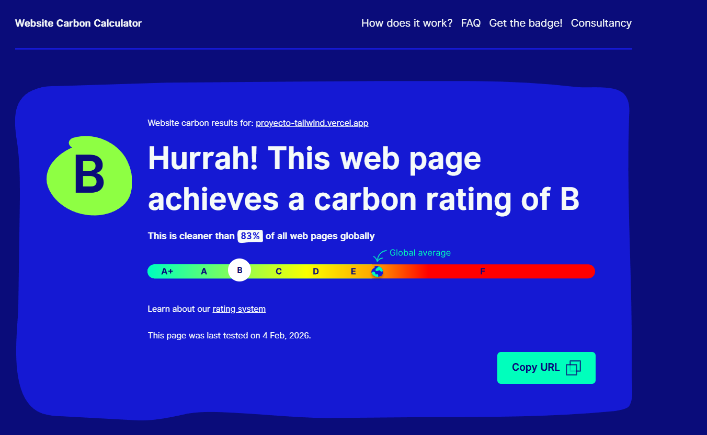

## 🌱 Rendimiento y Sostenibilidad

---

### 📊 Métricas de Rendimiento

Este proyecto mantiene altos estándares de rendimiento y sostenibilidad:

<table>
<tr>
<td width="50%" valign="top">

#### 🌍 Huella de Carbono
- ✅ **Calificación B**
- 🌿 Más limpio que el **83%** de las webs globales
- 🔋 Optimizado para bajo consumo energético

</td>
<td width="50%" valign="top">

#### ⚡ Rendimiento Web
- 🚀 **99/100** en velocidad de carga
- ♿ **89/100** en accesibilidad
- ✅ **100/100** en mejores prácticas
- 🔍 **82/100** en SEO

</td>
</tr>
</table>

---

### ♻️ Buenas Prácticas Implementadas

- 🖼️ Optimización de imágenes y recursos
- 📦 Minificación de código
- ⚡ Carga eficiente y asíncrona
- 🎯 Código limpio y mantenible

> 📅 Última medición: **4 de febrero de 2026**
